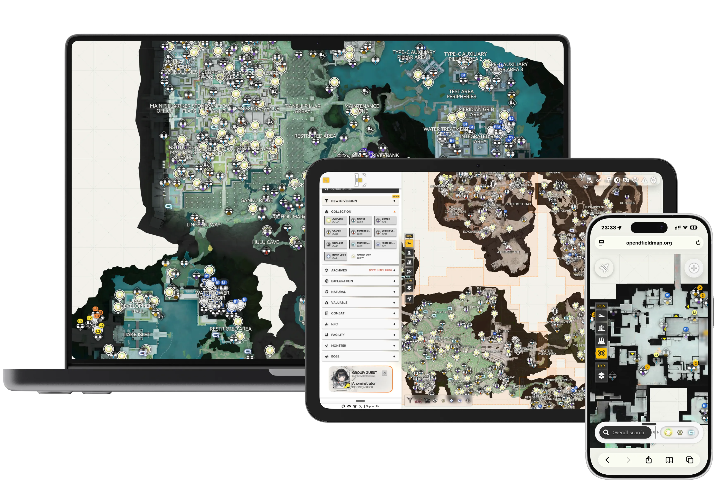

# Atlos
<ruby>
Atlos (= Atlas)
<rt>from Talos, an anagram trick</rt>
</ruby>is an open-source online map for the 3D RTSRPG game Arknights: Endfield. This repository contains the web client (codename <code>talos</code>) built with React + Vite, featuring an Endfield-esque UI, multilingual support, and a CDN‑friendly build pipeline.



<p align="center">
  <a href="https://opendfieldmap.org">Website</a> ·
  <a href="https://discord.gg/BFMAKZSUG7">Discord</a> ·
  <a href="CONTRIBUTING.md">Contributing</a>
</p>

## Community

[](https://discord.gg/2PMegCX4wJ)
[](https://github.com/Terra-Online/Atlos/actions/workflows/build.yml)
[](CONTRIBUTING.md)
[](React)


[](LICENSE)

Come and chat with us on **Discord**: [https://discord.gg/BFMAKZSUG7](https://discord.gg/BFMAKZSUG7)

## Contributing
Please read [CONTRIBUTING.md](CONTRIBUTING.md) for:
- environment setup
- coding standards & linting
- branch/commit/PR conventions
- translation workflow

<details>
<summary>Click to see repository layout</summary>

Top-level folders you’ll most likely interact with:
- `docs/` - the documentation files
- `talos/` – the web app
  - `src/` – application source
    - `assets/` - icons and logos
    - `component/` – UI components
    - `data/` - Game related data
    - `locale/` – i18n system, UI text resources
    - `store/` – global UI state (Zustand)
    - `styles/` – shared SCSS (palette, fonts, globals)
    - `lib/`, `platform/`, and `services/` – shared helpers, runtime adapters, and domain APIs
  - `apps/` - standalone OEM apps separate from the main SPA, each deployed as an independent route (e.g. `oem.re/intel`)
  - `public/` – public static assets
  - `config/` – build-time config (ignored by Git), see “Build & Deploy”
  - `scripts/` – helper scripts (e.g. publish to OSS/CDN)
  - `oem-relink/` - short link service
  - `oem-search/` - cloud-based OEM search service

</details>

## Getting started

Requirements:
- Node.js 20+
- pnpm 10+

```bash
cd talos 				# 0) Enter working menu
pnpm install 			# 1) Install deps
pnpm dev 				# 2) Start dev server
pnpm run type-check 	# 3) Type check (optional)
pnpm build 				# 4) Build for production
```

## License

This project is licensed under the **GNU Affero General Public License v3.0**. See [LICENSE](LICENSE) for the full text.

<p align="center">

</p>